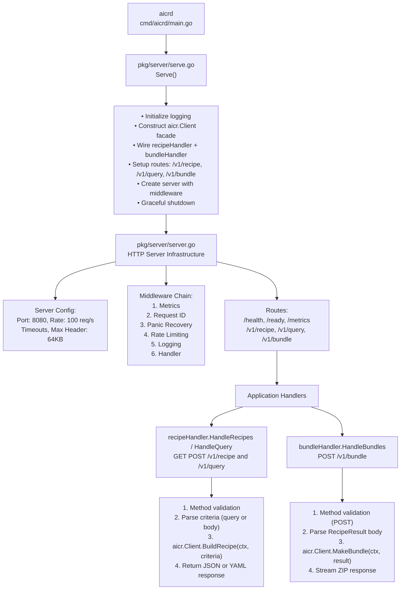
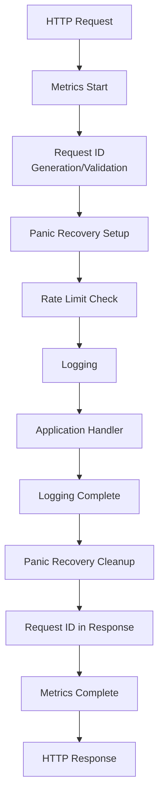
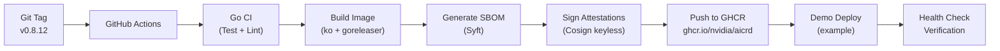

# API Server Architecture

The `aicrd` provides HTTP REST API access to AICR configuration recipe generation and bundle creation capabilities.

## Overview

The API server provides HTTP REST access to **Steps 2 and 4 of the AICR workflow** — recipe generation (`GET /v1/recipe`) and bundle creation (`POST /v1/bundle`). Built on Go's `net/http` with middleware for rate limiting, metrics, request tracking, and graceful shutdown.

### Four-Step Workflow Context

```
┌──────────────┐      ┌──────────────┐      ┌──────────────┐      ┌──────────────┐
│   Snapshot   │─────▶│    Recipe    │─────▶│   Validate   │─────▶│    Bundle    │
└──────────────┘      └──────────────┘      └──────────────┘      └──────────────┘
   CLI/Agent only       API Server           CLI only            API Server
```

**API Server scope:**
- Recipe generation (Step 2, query mode only — no snapshot analysis) and bundle creation (Step 4)
- Health, readiness, and Prometheus metrics endpoints
- SLSA Build Level 3 attestations on released images
- No snapshot capture, no validation, no ConfigMap I/O — use the CLI for those

**API Server configuration:**
- Criteria allowlists for accelerator, service, intent, OS via `AICR_ALLOWED_*` env vars
- Value overrides on `/v1/bundle` via `?set=bundler:path=value` (all deployers) and `?dynamic=component:path` (helm, argocd-helm, flux, and helmfile deployers; argocd rejects `?dynamic` — use argocd-helm)
- Node scheduling via `?system-node-selector` and `?accelerated-node-selector`
- Air-gap vendoring via `?vendor-charts=true` — the API server container must have `helm` on `$PATH` and credentials for any private upstream registries (`HELM_REPOSITORY_USERNAME`/`HELM_REPOSITORY_PASSWORD` env vars for HTTP(S); docker config for OCI). The bundle's `provenance.yaml` (at the bundle root) records each vendored chart with name, version, source URL, and SHA256 for air-gap auditing and CVE-yank cross-referencing

For the complete workflow (snapshot → recipe → validate → bundle, ConfigMap I/O via `cm://namespace/name`, agent deployment, Chainsaw E2E in `tests/chainsaw/cli/`), use the CLI.

## Architecture Diagram



## Request Flow

### Complete Request Flow with Middleware

```mermaid
flowchart TD
    A["HTTP Client<br/>GET /v1/recipe?os=ubuntu&gpu=gb200"] --> M1
    
    M1["1. Metrics Middleware<br/>• Start timer<br/>• Increment in-flight counter<br/>• Wrap response writer<br/>• Record duration & count"] --> M2
    
    M2["2. Request ID Middleware<br/>• Extract X-Request-Id<br/>• Generate UUID if missing<br/>• Store in context<br/>• Add to response header"] --> M3
    
    M3["3. Panic Recovery<br/>• Wrap in defer/recover<br/>• Log errors<br/>• Return 500 on panic"] --> M4
    
    M4["4. Rate Limit Middleware<br/>• Check rateLimiter.Allow()<br/>• Return 429 if exceeded<br/>• Add rate limit headers"] --> M5
    
    M5["5. Logging Middleware<br/>• Log request start<br/>• Capture status<br/>• Log completion"] --> H
    
    H["6. Application Handler<br/>recipeHandler.HandleRecipes"] --> H1

    H1["A. Method Validation<br/>(GET only)"] --> H2
    H2["B. Parse Query Parameters<br/>service, accelerator, intent, os, nodes"] --> H3
    H3["C. Format Validation<br/>• Validate enums<br/>• Parse values<br/>• Return 400 on error"] --> H3a
    H3a["D. Allowlist Validation<br/>• Check against configured allowlists<br/>• Return 400 if disallowed"] --> H4
    H4["E. Build Recipe<br/>• aicr.Client.BuildRecipe(ctx, criteria)<br/>• Load store (cached)<br/>• Apply matching overlays"] --> H5
    H5["F. Respond<br/>• Set Cache-Control<br/>• Serialize to JSON<br/>• Return 200 OK"] --> Z
    
    Z[JSON Response]
```



## Component Details

### Entry Point: `cmd/aicrd/main.go`

Minimal entry point:

```go
package main

import (
    "log"
    "github.com/NVIDIA/aicr/pkg/server"
)

func main() {
    if err := server.Serve(); err != nil {
        log.Fatal(err)
    }
}
```

### Server Package: `pkg/server/serve.go`

**Responsibilities:** initialize structured logging; parse criteria allowlists; construct the `aicr.Client` facade (long-lived, embedded data source); wire the recipe and bundle handlers as thin adapters over the facade; install signal handling; run server with middleware; handle graceful shutdown.

**Key Features:** version info injected via ldflags (`version`, `commit`, `date`); routes `/v1/recipe`, `/v1/query`, `/v1/bundle`; allowlists from `AICR_ALLOWED_*` env vars; production defaults; graceful shutdown on SIGINT/SIGTERM.

#### Initialization Flow

```go
func Serve() error {
    // Signal handling spans pre-Run setup and request handling
    ctx, stop := signal.NotifyContext(context.Background(), os.Interrupt, syscall.SIGTERM)
    defer stop()

    logging.SetDefaultStructuredLogger(name, version)

    allowLists, err := aicr.ParseAllowListsFromEnv()
    if err != nil {
        return errors.Wrap(errors.ErrCodeInternal, "failed to parse allowlists from environment", err)
    }

    client, err := aicr.NewClient(
        aicr.WithRecipeSource(aicr.EmbeddedSource()),
        aicr.WithVersion(version),
        aicr.WithAllowLists(allowLists),
    )
    if err != nil {
        return errors.Wrap(errors.ErrCodeInternal, "failed to construct aicr client", err)
    }
    defer client.Close()

    h := newRecipeHandler(client, allowLists)
    bh := newBundleHandler(client, allowLists)

    s := New(
        WithName(name),
        WithVersion(version),
        WithHandler(map[string]http.HandlerFunc{
            "/v1/recipe": h.HandleRecipes,
            "/v1/query":  h.HandleQuery,
            "/v1/bundle": bh.HandleBundles,
        }),
    )
    return s.Run(ctx)
}
```

### Server Infrastructure: `pkg/server/`

Production-ready HTTP server implementation. Core files:

**server.go** — Server struct (config, HTTP server, rate limiter, ready state); functional options; graceful shutdown via `signal.NotifyContext` and `errgroup`; default root handler listing routes.

**config.go** — Configuration struct with defaults; `PORT` env var; read/write/idle/shutdown timeouts; rate-limit parameters.

**middleware.go** — Middleware chain builder; request ID (UUID generation/validation), rate limiting (token bucket), panic recovery, structured logging.

**health.go** — `/health` (liveness, always 200) and `/ready` (readiness, 503 when not ready); JSON status + timestamp.

**errors.go** — Standardized error response struct, error codes (`RATE_LIMIT_EXCEEDED`, `INTERNAL_ERROR`, …), `WriteError` helper with request ID.

**metrics.go** — Prometheus metrics:
- `aicr_http_requests_total` (counter; method, path, status)
- `aicr_http_request_duration_seconds` (histogram; method, path)
- `aicr_http_requests_in_flight` (gauge)
- `aicr_rate_limit_rejects_total` (counter)
- `aicr_panic_recoveries_total` (counter)

**context.go** — Context key type for request ID storage.

**doc.go** — Package documentation: usage, endpoints, error handling, deployment.

#### Request Processing Pipeline



### Recipe Handler: `pkg/server/recipe_handler.go`

HTTP handler for recipe generation endpoint. Supports both GET (query parameters) and POST (criteria body) methods. The handler is a thin adapter over the `aicr.Client` facade — recipe resolution lives in `pkg/client/v1`, not in the handler.

#### Handler Flow

```go
func (h *recipeHandler) HandleRecipes(w http.ResponseWriter, r *http.Request) {
    var criteria *recipe.Criteria
    var err error

    // 1. Route based on HTTP method
    switch r.Method {
    case http.MethodGet:
        // 2a. Parse query parameters for GET
        criteria, err = recipe.ParseCriteriaFromRequest(r, h.client.CriteriaRegistry())
    case http.MethodPost:
        // 2b. Parse request body for POST (JSON or YAML), bounded by MaxRecipePOSTBytes
        bounded := http.MaxBytesReader(w, r.Body, defaults.MaxRecipePOSTBytes)
        defer bounded.Close()
        criteria, err = recipe.ParseCriteriaFromBody(bounded, r.Header.Get("Content-Type"), h.client.CriteriaRegistry())
    default:
        // Reject other methods
        w.Header().Set("Allow", "GET, POST")
        return 405
    }

    // 3. Validate criteria format (handled inline by ParseCriteria*)

    // 4. Validate against allowlists (if configured)
    if h.allowLists != nil {
        if err := validateAgainstAllowLists(h.allowLists, criteria); err != nil {
            return 400 with allowed values in error details
        }
    }

    // 5. Resolve recipe via the facade
    result, err := h.client.ResolveRecipeFromCriteria(ctx, aicr.WrapCriteria(criteria))
    if err != nil {
        return 500
    }

    // 6. Set cache headers
    w.Header().Set("Cache-Control", "public, max-age=600")

    // 7. Respond with JSON (upstream RecipeResult shape preserved)
    serializer.RespondJSON(w, http.StatusOK, result.Resolved())
}
```

#### POST Request Body Format

POST requests accept a `RecipeCriteria` resource (Kubernetes-style):

```yaml
kind: RecipeCriteria
apiVersion: aicr.nvidia.com/v1alpha1
metadata:
  name: my-criteria
spec:
  service: eks
  accelerator: gb200
  os: ubuntu
  intent: training
```

Supported content types:
- `application/json` - JSON format
- `application/x-yaml` - YAML format

#### Query Parameter Parsing

| Parameter | Type | Validation | Example |
|-----------|------|------------|--------|
| `service` | ServiceType | Enum: eks, gke, aks, oke, kind, lke, bcm, any | `service=eks` |
| `accelerator` | AcceleratorType | Enum: h100, h200, gb200, b200, a100, l40, rtx-pro-6000, any | `accelerator=h100` |
| `gpu` | AcceleratorType | Alias for accelerator | `gpu=h100` |
| `intent` | IntentType | Enum: training, inference, any | `intent=training` |
| `os` | OSType | Enum: ubuntu, rhel, cos, amazonlinux, talos, any | `os=ubuntu` |
| `platform` | PlatformType | Enum: dynamo, kubeflow, nim, runai, slurm, any | `platform=kubeflow` |
| `nodes` | int | >= 0 | `nodes=8` |

### Recipe Resolution: `pkg/client/v1` (aicr.Client facade)

Shared with CLI — both entry points construct an `aicr.Client` and call `ResolveRecipeFromCriteria` for recipe resolution and `AdoptRecipe` + `MakeBundle` for bundling. The facade composes `pkg/recipe` (registry, overlay merge, criteria registry) and `pkg/bundler` (per-component generators) so handlers stay free of business logic. See [CLI Architecture](cli.md) for the same control flow on the CLI side.

## API Endpoints

### Recipe Generation

Endpoints `GET /v1/recipe` (query parameters) and `POST /v1/recipe` (criteria body, `application/json` or `application/x-yaml`). See [Query Parameter Parsing](#query-parameter-parsing) above for the GET parameter table and [POST Request Body Format](#post-request-body-format) above for the body schema.

**Response**: 200 OK

```json
{
  "apiVersion": "aicr.nvidia.com/v1alpha1",
  "kind": "Recipe",
  "metadata": {
    "version": "v1.0.0",
    "created": "2025-12-25T12:00:00Z",
    "appliedOverlays": [
      "base",
      "eks",
      "eks-training",
      "gb200-eks-training"
    ],
    "excludedOverlays": [
      {
        "name": "h100-eks-ubuntu-training",
        "reason": "mixin-constraint-failed"
      }
    ],
    "constraintWarnings": [
      {
        "overlay": "h100-eks-ubuntu-training",
        "constraint": "OS.sysctl./proc/sys/kernel/osrelease",
        "expected": ">= 6.8",
        "actual": "5.15.0",
        "reason": "mixin-constraint-failed: expected >= 6.8, got 5.15.0"
      }
    ]
  },
  "criteria": {
    "service": "eks",
    "accelerator": "gb200",
    "intent": "training",
    "os": "any"
  },
  "componentRefs": [
    {
      "name": "gpu-operator",
      "version": "v25.3.3",
      "order": 1
    }
  ],
  "constraints": {
    "driver": {
      "version": "580.82.07"
    }
  }
}
```

`metadata.excludedOverlays` is optional. When present, it contains structured `{name, reason}` entries so API consumers can distinguish direct constraint failures from post-compose mixin fallback.

**Error Response**: 400 Bad Request

```json
{
  "code": "INVALID_REQUEST",
  "message": "Invalid recipe criteria",
  "details": {
    "error": "[INVALID_REQUEST] invalid accelerator parameter: [INVALID_REQUEST] invalid accelerator type: invalid-gpu"
  },
  "requestId": "550e8400-e29b-41d4-a716-446655440000",
  "timestamp": "2025-12-25T12:00:00Z",
  "retryable": false
}
```

**Rate Limited**: 429 Too Many Requests

```json
{
  "code": "RATE_LIMIT_EXCEEDED",
  "message": "Rate limit exceeded",
  "details": {
    "limit": 100,
    "burst": 200
  },
  "requestId": "550e8400-e29b-41d4-a716-446655440000",
  "timestamp": "2025-12-25T12:00:00Z",
  "retryable": true
}
```

**Headers**:
- `X-Request-Id` - Unique request identifier
- `X-RateLimit-Limit` - Total requests allowed per second
- `X-RateLimit-Remaining` - Requests remaining in current window
- `X-RateLimit-Reset` - Unix timestamp when window resets
- `Cache-Control` - Caching policy (public, max-age=600)

### Health Check

**Endpoint**: `GET /health`

**Response**: 200 OK

```json
{
  "status": "healthy",
  "timestamp": "2025-12-25T12:00:00Z"
}
```

### Readiness Check

**Endpoint**: `GET /ready`

**Response**: 200 OK (ready) or 503 Service Unavailable (not ready)

```json
{
  "status": "ready",
  "timestamp": "2025-12-25T12:00:00Z"
}
```

### Metrics

**Endpoint**: `GET /metrics`

**Response**: Prometheus text format

```
# HELP aicr_http_requests_total Total number of HTTP requests
# TYPE aicr_http_requests_total counter
aicr_http_requests_total{method="GET",path="/v1/recipe",status="200"} 1234

# HELP aicr_http_request_duration_seconds HTTP request latency in seconds
# TYPE aicr_http_request_duration_seconds histogram
aicr_http_request_duration_seconds_bucket{method="GET",path="/v1/recipe",le="0.005"} 1000
aicr_http_request_duration_seconds_sum{method="GET",path="/v1/recipe"} 12.34
aicr_http_request_duration_seconds_count{method="GET",path="/v1/recipe"} 1234

# HELP aicr_http_requests_in_flight Current number of HTTP requests being processed
# TYPE aicr_http_requests_in_flight gauge
aicr_http_requests_in_flight 5

# HELP aicr_rate_limit_rejects_total Total number of requests rejected due to rate limiting
# TYPE aicr_rate_limit_rejects_total counter
aicr_rate_limit_rejects_total 42

# HELP aicr_panic_recoveries_total Total number of panics recovered in HTTP handlers
# TYPE aicr_panic_recoveries_total counter
aicr_panic_recoveries_total 0
```

### Root

**Endpoint**: `GET /`

**Response**: 200 OK

```json
{
  "service": "aicrd",
  "version": "v1.0.0",
  "routes": [
    "/v1/recipe",
    "/v1/query",
    "/v1/bundle"
  ]
}
```

## Usage Examples

### cURL Examples

```bash
# Basic recipe request
curl "http://localhost:8080/v1/recipe?os=ubuntu&gpu=h100"

# Full specification
curl "http://localhost:8080/v1/recipe?os=ubuntu&service=eks&accelerator=gb200&intent=training&nodes=8"

# With request ID
curl -H "X-Request-Id: 550e8400-e29b-41d4-a716-446655440000" \
  "http://localhost:8080/v1/recipe?os=ubuntu&gpu=h100"

# Health check
curl http://localhost:8080/health

# Readiness check
curl http://localhost:8080/ready

# Metrics
curl http://localhost:8080/metrics
```

## Demo API Server Deployment

> **Note**: This section describes the **demonstration deployment** of the `aicrd` API server for testing and development purposes only. It is not a production service. Users should self-host the `aicrd` API server in their own infrastructure for production use. See the [Kubernetes Deployment](#kubernetes-deployment) section below for deployment guidance.

### Example: Google Cloud Run

The demo API server is deployed to Google Cloud Run as an example of how to deploy `aicrd`:

**Demo Configuration:**
- **Platform**: Google Cloud Run (fully managed serverless)
- **Authentication**: Public access (for demo purposes)
- **Auto-scaling**: 0-100 instances based on load
- **Region**: `us-west1`

**CI/CD Pipeline** (`on-tag.yaml`):


**Supply Chain Security:**
- **SLSA Build Level 3** compliance
- **Signed SBOMs** in SPDX format
- **Attestations** logged in Rekor transparency log
- **Verification**: `gh attestation verify oci://ghcr.io/nvidia/aicrd:TAG --owner nvidia`

**Demo Monitoring:**
- Health endpoint: `/health`
- Readiness endpoint: `/ready`
- Prometheus metrics: `/metrics`
- Request tracing with `X-Request-Id` headers

**Scaling Behavior (demo):**
- **Min instances**: 0 (scales to zero when idle)
- **Max instances**: 100 (automatic scaling)
- **Cold start**: 2-3 seconds
- **Request timeout**: 30 seconds
- **Concurrency**: 80 requests per instance

**Cloud Run Benefits (for reference):**
- Zero operational overhead
- Automatic HTTPS with managed certificates
- Built-in DDoS protection
- Pay-per-use pricing (scales to zero)
- Global load balancing

### Client Libraries

**Go Client**:

```go
import (
    "encoding/json"
    "fmt"
    "net/http"
    "net/url"
)

func getRecipe(os, gpu string) (*Recipe, error) {
    baseURL := "http://localhost:8080/v1/recipe"
    params := url.Values{}
    params.Add("os", os)
    params.Add("gpu", gpu)
    
    resp, err := http.Get(baseURL + "?" + params.Encode())
    if err != nil {
        return nil, err
    }
    defer resp.Body.Close()
    
    if resp.StatusCode != http.StatusOK {
        return nil, fmt.Errorf("unexpected status: %d", resp.StatusCode)
    }
    
    var recipe Recipe
    if err := json.NewDecoder(resp.Body).Decode(&recipe); err != nil {
        return nil, err
    }
    
    return &recipe, nil
}
```

**Python Client**:

```python
import requests

def get_recipe(os, gpu):
    url = "http://localhost:8080/v1/recipe"
    params = {"os": os, "gpu": gpu}
    
    response = requests.get(url, params=params)
    response.raise_for_status()
    
    return response.json()

# Usage
recipe = get_recipe("ubuntu", "h100")
print(f"Applied overlays: {recipe['metadata']['appliedOverlays']}")
```

## Kubernetes Deployment

### Deployment Manifest

```yaml
apiVersion: apps/v1
kind: Deployment
metadata:
  name: aicrd
  namespace: aicr-system
spec:
  replicas: 3
  selector:
    matchLabels:
      app: aicrd
  template:
    metadata:
      labels:
        app: aicrd
    spec:
      containers:
      - name: server
        image: ghcr.io/nvidia/aicrd:v1.0.0
        ports:
        - containerPort: 8080
          name: http
        env:
        - name: PORT
          value: "8080"
        resources:
          requests:
            cpu: 100m
            memory: 128Mi
          limits:
            cpu: 500m
            memory: 512Mi
        livenessProbe:
          httpGet:
            path: /health
            port: http
          initialDelaySeconds: 10
          periodSeconds: 10
        readinessProbe:
          httpGet:
            path: /ready
            port: http
          initialDelaySeconds: 5
          periodSeconds: 5
---
apiVersion: v1
kind: Service
metadata:
  name: aicrd
  namespace: aicr-system
spec:
  selector:
    app: aicrd
  ports:
  - port: 80
    targetPort: http
  type: ClusterIP
---
apiVersion: v1
kind: ServiceMonitor
metadata:
  name: aicrd
  namespace: aicr-system
spec:
  selector:
    matchLabels:
      app: aicrd
  endpoints:
  - port: http
    path: /metrics
    interval: 30s
```

### Ingress with TLS

```yaml
apiVersion: networking.k8s.io/v1
kind: Ingress
metadata:
  name: aicrd
  namespace: aicr-system
  annotations:
    cert-manager.io/cluster-issuer: letsencrypt-prod
spec:
  tls:
  - hosts:
    - api.aicr.nvidia.com
    secretName: aicr-api-tls
  rules:
  - host: api.aicr.nvidia.com
    http:
      paths:
      - path: /
        pathType: Prefix
        backend:
          service:
            name: aicrd
            port:
              number: 80
```

### HorizontalPodAutoscaler

```yaml
apiVersion: autoscaling/v2
kind: HorizontalPodAutoscaler
metadata:
  name: aicrd
  namespace: aicr-system
spec:
  scaleTargetRef:
    apiVersion: apps/v1
    kind: Deployment
    name: aicrd
  minReplicas: 3
  maxReplicas: 10
  metrics:
  - type: Resource
    resource:
      name: cpu
      target:
        type: Utilization
        averageUtilization: 70
  - type: Pods
    pods:
      metric:
        name: aicr_http_requests_in_flight
      target:
        type: AverageValue
        averageValue: "50"
```

## Performance Characteristics

### Throughput

- **Rate Limit**: 100 requests/second per instance (configurable)
- **Burst**: 200 requests (configurable)
- **Target Latency**: p50 &lt;10ms, p99 &lt;50ms
- **Max Concurrent**: Limited by rate limiter

### Resource Usage

- **CPU**: ~50m idle, ~200m at 100 req/s
- **Memory**: ~100MB baseline, ~200MB at peak
- **Disk**: None (stateless, embedded recipe data)

### Scalability

- **Horizontal**: Fully stateless, linear scaling
- **Vertical**: Recipe store cached in memory (sync.Once)
- **Load Balancing**: Round-robin or least-connections

### Caching Strategy

- **Recipe Store**: Loaded once per process, cached globally
- **Client-Side**: 10-minute cache via Cache-Control header (`defaults.RecipeCacheTTL`)
- **CDN**: Recommended for public-facing deployments

## Error Handling

### Error Response Format

All errors follow a consistent JSON structure:

```json
{
  "code": "ERROR_CODE",
  "message": "Human-readable error message",
  "details": {"key": "value"},
  "requestId": "uuid",
  "timestamp": "2025-12-25T12:00:00Z",
  "retryable": true/false
}
```

### Error Codes

| Code | HTTP Status | Description | Retryable |
|------|-------------|-------------|-----------|
| `RATE_LIMIT_EXCEEDED` | 429 | Too many requests | Yes |
| `INVALID_REQUEST` | 400 | Invalid parameters or disallowed criteria value | No |
| `METHOD_NOT_ALLOWED` | 405 | Wrong HTTP method | No |
| `INTERNAL_ERROR` | 500 | Server error | Yes |
| `SERVICE_UNAVAILABLE` | 503 | Not ready | Yes |

**Allowlist Validation Error Example:**

When a request uses a criteria value not in the configured allowlist:

```json
{
  "code": "INVALID_REQUEST",
  "message": "accelerator type not allowed",
  "details": {
    "requested": "gb200",
    "allowed": ["h100", "l40"]
  },
  "requestId": "550e8400-e29b-41d4-a716-446655440000",
  "timestamp": "2026-01-27T12:00:00Z",
  "retryable": false
}
```

### Error Handling Strategy

1. **Validation Errors**: Return 400 with specific error message
2. **Rate Limiting**: Return 429 with Retry-After header
3. **Panics**: Recover, log, return 500
4. **Context Cancellation**: Return early, cleanup resources
5. **Resource Exhaustion**: Rate limiting prevents this

## Security

### Attack Mitigation

**Rate Limiting**:
- Token bucket algorithm prevents abuse
- Per-instance limit (shared across all clients)
- Configurable limits and burst

**Header Attacks**:
- 64KB header size limit
- 5-second header read timeout
- Prevents slowloris attacks

**Resource Exhaustion**:
- Request timeouts (read, write, idle)
- In-flight request limits
- Graceful shutdown prevents connection drops

**Input Validation**:
- Strict enum validation
- Version string parsing with bounds
- UUID validation for request IDs

### Production Considerations

**TLS**:
- Use reverse proxy (nginx, Envoy) for TLS termination
- Or add TLS support to server (future enhancement)

**Authentication**:
- Add API key middleware (future enhancement)
- Or use service mesh mTLS (Istio, Linkerd)

**Authorization**:
- Currently none (public API)
- Could add rate limits per API key

**Monitoring**:
- Prometheus metrics for observability
- Request ID tracking for distributed tracing
- Structured logging for debugging

## Monitoring and Observability

### Prometheus Metrics

**Request Metrics**:
- `aicr_http_requests_total` - Total requests by method, path, status
- `aicr_http_request_duration_seconds` - Request latency histogram
- `aicr_http_requests_in_flight` - Current active requests

**Error Metrics**:
- `aicr_rate_limit_rejects_total` - Rate limit rejections
- `aicr_panic_recoveries_total` - Panic recoveries

### Grafana Dashboard

Example queries:

```promql
# Request rate
rate(aicr_http_requests_total[5m])

# Error rate
rate(aicr_http_requests_total{status=~"5.."}[5m])

# Latency percentiles
histogram_quantile(0.99, rate(aicr_http_request_duration_seconds_bucket[5m]))

# Rate limit rejections
rate(aicr_rate_limit_rejects_total[5m])
```

### Alerting Rules

```yaml
groups:
- name: aicrd
  rules:
  - alert: HighErrorRate
    expr: rate(aicr_http_requests_total{status=~"5.."}[5m]) > 0.05
    for: 5m
    annotations:
      summary: High error rate on aicrd
  
  - alert: HighLatency
    expr: histogram_quantile(0.99, rate(aicr_http_request_duration_seconds_bucket[5m])) > 0.1
    for: 5m
    annotations:
      summary: High latency on aicrd
  
  - alert: HighRateLimitRejects
    expr: rate(aicr_rate_limit_rejects_total[5m]) > 10
    for: 5m
    annotations:
      summary: High rate limit rejections
```

### Distributed Tracing

Request ID tracking enables correlation:

1. Client sends request with `X-Request-Id` header
2. Server logs all operations with request ID
3. Response includes same `X-Request-Id`
4. Client can correlate logs across services

Future: OpenTelemetry integration for full tracing

## Testing Strategy

### Unit Tests

- Handler validation logic
- Middleware functionality
- Error response formatting
- Query parsing

### Integration Tests

- Full HTTP request/response cycle
- Rate limiting behavior
- Graceful shutdown
- Health/ready endpoints

### Load Tests

- Sustained load at rate limit
- Burst handling
- Latency under load
- Memory stability

### Example Test

```go
func TestRecipeHandler(t *testing.T) {
    // Create test client + handler (facade-backed; no business logic in pkg/server)
    client, err := aicr.NewClient(aicr.WithRecipeSource(aicr.EmbeddedSource()))
    assert.NoError(t, err)
    defer client.Close()
    handler := newRecipeHandler(client, nil).HandleRecipes

    // Create test request
    req := httptest.NewRequest(
        "GET",
        "/v1/recipe?os=ubuntu&gpu=h100",
        nil,
    )
    w := httptest.NewRecorder()

    // Execute handler
    handler(w, req)

    // Verify response
    assert.Equal(t, http.StatusOK, w.Code)

    var resp recipe.RecipeResult
    err = json.Unmarshal(w.Body.Bytes(), &resp)
    assert.NoError(t, err)
}
```

## Dependencies

### External Libraries

- `net/http` - Standard HTTP server
- `golang.org/x/time/rate` - Rate limiting
- `golang.org/x/sync/errgroup` - Concurrent error handling
- `github.com/prometheus/client_golang` - Prometheus metrics
- `github.com/google/uuid` - UUID generation
- `gopkg.in/yaml.v3` - Recipe store parsing
- `log/slog` - Structured logging

### Internal Packages

- `pkg/client/v1` - aicr.Client facade (recipe + bundle entry points) shared with CLI
- `pkg/recipe` - Recipe resolution, registry, criteria registry
- `pkg/bundler` - Per-component bundle generation (invoked via the facade)
- `pkg/measurement` - Data model
- `pkg/version` - Semantic versioning
- `pkg/serializer` - JSON response formatting
- `pkg/logging` - Logging configuration

## Build and Deployment

### Automated CI/CD Pipeline

**Production builds** are automated through GitHub Actions workflows. When a semantic version tag is pushed (e.g., `v0.8.12`), the `on-tag.yaml` workflow:

1. **Validates** code with Go CI (tests + linting)
2. **Builds** multi-platform binaries and container images with GoReleaser and ko
3. **Generates** SBOMs (SPDX for binaries and for containers)
4. **Attests** images with SLSA v1.0 provenance and SBOM attestations
5. **Deploys** to Google Cloud Run with Workload Identity Federation

**Supply Chain Security**:
- SLSA Build Level 3 compliance
- Cosign keyless signing with Fulcio + Rekor
- GitHub Attestation API for provenance
- Multi-platform builds: darwin/linux × amd64/arm64

**Verify Release Artifacts**:
```bash
# Get latest release tag
export TAG=$(curl -s https://api.github.com/repos/NVIDIA/aicr/releases/latest | jq -r '.tag_name')

# Verify attestations
gh attestation verify oci://ghcr.io/nvidia/aicrd:${TAG} --owner nvidia
```

For detailed CI/CD architecture, see [CONTRIBUTING.md](https://github.com/NVIDIA/aicr/blob/main/CONTRIBUTING.md#github-actions--cicd) and the [Architecture Overview](index.md).

### Local Build Configuration

For local development and testing:

```makefile
VERSION ?= $(shell git describe --tags --always --dirty)
COMMIT ?= $(shell git rev-parse --short HEAD)
DATE ?= $(shell date -u +%Y-%m-%dT%H:%M:%SZ)

LDFLAGS := -X github.com/NVIDIA/aicr/pkg/server.version=$(VERSION)
LDFLAGS += -X github.com/NVIDIA/aicr/pkg/server.commit=$(COMMIT)
LDFLAGS += -X github.com/NVIDIA/aicr/pkg/server.date=$(DATE)

go build -ldflags="$(LDFLAGS)" -o bin/aicrd ./cmd/aicrd
```

### Container Image

Production images are built with ko (automated in CI/CD). For local development:

```dockerfile
FROM golang:1.26-alpine AS builder
WORKDIR /app
COPY . .
RUN go build -ldflags="-X github.com/NVIDIA/aicr/pkg/server.version=v1.0.0" \
    -o /bin/aicrd ./cmd/aicrd

FROM alpine:3.19
RUN apk --no-cache add ca-certificates
COPY --from=builder /bin/aicrd /usr/local/bin/
EXPOSE 8080
ENTRYPOINT ["aicrd"]
```

**Note**: Production images use distroless base (gcr.io/distroless/static) for minimal attack surface.

### Environment Variables

| Variable | Default | Description |
|----------|---------|-------------|
| `PORT` | `8080` | Server port |
| `AICR_ALLOWED_ACCELERATORS` | (none) | Comma-separated list of allowed GPU types (e.g., `h100,l40`). If not set, all types allowed. |
| `AICR_ALLOWED_SERVICES` | (none) | Comma-separated list of allowed K8s services (e.g., `eks,gke`). If not set, all services allowed. |
| `AICR_ALLOWED_INTENTS` | (none) | Comma-separated list of allowed intents (e.g., `training`). If not set, all intents allowed. |
| `AICR_ALLOWED_OS` | (none) | Comma-separated list of allowed OS types (e.g., `ubuntu,rhel`). If not set, all OS types allowed. |

#### Criteria Allowlists

When allowlist environment variables are configured, the API server validates incoming requests against the allowed values. This enables operators to restrict the API to specific configurations.

```bash
# Start server with restricted accelerators
export AICR_ALLOWED_ACCELERATORS=h100,l40
export AICR_ALLOWED_SERVICES=eks,gke
./aicrd

# Server logs on startup:
# INFO criteria allowlists configured accelerators=2 services=2 intents=0 os_types=0
# DEBUG criteria allowlists loaded accelerators=["h100","l40"] services=["eks","gke"] intents=[] os_types=[]
```

**Validation behavior:**
- Requests with disallowed values return HTTP 400 with error details
- The `any` value is always allowed regardless of allowlist
- Both `/v1/recipe` and `/v1/bundle` endpoints enforce allowlists
- CLI (`aicr`) is not affected by allowlists
- The `platform` criteria field has no allowlist env var today; all valid platform enum values are accepted (invalid enum values are rejected with HTTP 400 by the criteria parser)

## Extension and Operating Patterns

Forward-looking guidance — Future Enhancements, Production Deployment Patterns,
Reliability Patterns, Performance Optimization, Security Hardening, and
Observability extensions — has moved to a dedicated page so this document can
stay focused on what the API server does today.

See [API Server: Extension and Operating Patterns](api-server-extending.md).

## References

### Official Documentation

- [net/http Package](https://pkg.go.dev/net/http) - Go standard HTTP library  
- [golang.org/x/time/rate](https://pkg.go.dev/golang.org/x/time/rate) - Token bucket rate limiter  
- [errgroup](https://pkg.go.dev/golang.org/x/sync/errgroup) - Concurrent error handling  
- [context Package](https://pkg.go.dev/context) - Request cancellation and deadlines  
- [slog Package](https://pkg.go.dev/log/slog) - Structured logging

### Production Patterns

- [Kubernetes Patterns](https://k8s.io/docs/concepts/) - Deployment, scaling, networking  
- [Twelve-Factor App](https://12factor.net/) - Cloud-native application principles  
- [Google SRE Book](https://sre.google/sre-book/table-of-contents/) - Site reliability engineering  
- [Release Engineering](https://sre.google/workbook/release-engineering/) - Deployment best practices

### HTTP and APIs

- [HTTP/2 in Go](https://go.dev/blog/h2push) - HTTP/2 server push  
- [RESTful API Design](https://cloud.google.com/apis/design) - Google Cloud API design guide  
- [OpenAPI Specification](https://swagger.io/specification/) - API documentation standard  
- [API Versioning](https://cloud.google.com/apis/design/versioning) - Version management strategies

### Observability

- [Prometheus Go Client](https://prometheus.io/docs/guides/go-application/) - Metrics collection  
- [OpenTelemetry Go](https://opentelemetry.io/docs/languages/go/) - Distributed tracing  
- [Grafana Dashboards](https://grafana.com/docs/grafana/latest/) - Metrics visualization  
- [Jaeger Tracing](https://www.jaegertracing.io/docs/) - Distributed tracing backend

### Security

- [OWASP API Security](https://owasp.org/www-project-api-security/) - API security risks  
- [HTTP Security Headers](https://owasp.org/www-project-secure-headers/) - Security header reference  
- [Rate Limiting Strategies](https://cloud.google.com/architecture/rate-limiting-strategies) - Google Cloud guide  
- [mTLS in Kubernetes](https://istio.io/latest/docs/concepts/security/) - Istio mutual TLS

### Performance

- [Go Performance Tips](https://github.com/golang/go/wiki/Performance) - Optimization techniques  
- [pprof Profiler](https://go.dev/blog/pprof) - CPU and memory profiling  
- [High Performance Go](https://dave.cheney.net/high-performance-go-workshop/dotgo-paris.html) - Dave Cheney's workshop  
- [Go Memory Model](https://go.dev/ref/mem) - Concurrency guarantees

### Reliability

- [Circuit Breaker Pattern](https://github.com/sony/gobreaker) - Failure isolation  
- [Retry with Backoff](https://github.com/cenkalti/backoff) - Resilient retries  
- [Chaos Engineering](https://principlesofchaos.org/) - Resilience testing principles  
- [SLOs and Error Budgets](https://sre.google/sre-book/service-level-objectives/) - Reliability targets
