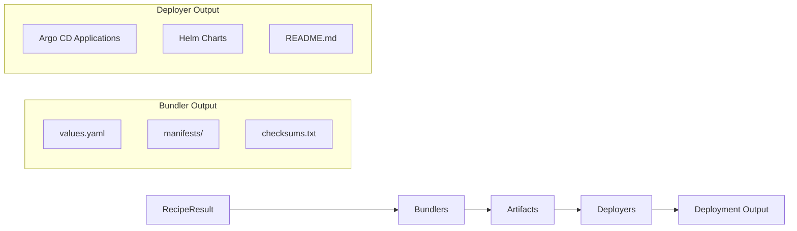

# Bundler Development Guide

Learn how to add new components to AICR.

## Overview

The bundler system converts RecipeInput objects into deployment artifacts (Helm values files, Kubernetes manifests, optional custom manifests). READMEs are generated at the deployer level, not by individual component bundlers.

**Architecture:** Component configuration is declarative in `recipes/registry.yaml` — adding a component requires only a registry entry and values files, no Go code. `pkg/bundler.DefaultBundler` generates Helm per-component bundles from recipes; components are selected by `componentRefs`. CLI `--set` overrides flow through `ApplyMapOverrides()`. The registry declares paths for injecting node selectors / tolerations. Errors use `pkg/errors` codes.

### Local Format (Shared Bundle Layout)

`pkg/bundler/deployer/localformat` writes the uniform numbered `NNN-<component>/` bundle layout consumed by every deployer. It owns per-folder content (Chart.yaml, values.yaml, cluster-values.yaml, install.sh, templates/, upstream.env). Deployers (`helm`, `helmfile` per [#632](https://github.com/NVIDIA/aicr/issues/632), `argocd`, `argocd-helm`, `flux`) call `localformat.Write()` and then add their own top-level orchestration files (deploy.sh, helmfile.yaml, Application CRs, etc.) — they never re-classify components or duplicate the per-folder writer.

**Classification rule** (single source of truth, in `localformat.classify`):

| Recipe shape | Folder kind | Notes |
|---|---|---|
| `helm.defaultRepository` set, no `manifestFiles` | `KindUpstreamHelm` | upstream chart referenced via `upstream.env`; no Chart.yaml |
| `helm.defaultRepository` set + `manifestFiles` (mixed) | `KindUpstreamHelm` (primary) + `KindLocalHelm` (`-post` injected) | two adjacent folders; raw manifests deploy post-install |
| `helm.defaultRepository == ""` + `manifestFiles` | `KindLocalHelm` | manifest-only wrapped chart |
| `kustomize` (Tag/Path set) | `KindLocalHelm` | `kustomize build` at bundle time → `templates/manifest.yaml` |

**Load-bearing invariants** (don't violate without changing the design):

1. **`localformat` never writes deployer-specific files.** `deploy.sh`, `helmfile.yaml`, argocd `Application` CRs, Flux `HelmRelease`s — all produced by the respective deployer after `Write()` returns. This separation is what makes a single layout consumable by every deployer.
2. **`install.sh` is never name-customized.** It is rendered from one of exactly two templates (`install-upstream-helm.sh.tmpl`, `install-local-helm.sh.tmpl`), parameterized only by data (name, namespace, upstream ref). Name-keyed quirks (kai-scheduler async timeout, nodewright-operator taint cleanup, DRA restart, orphan-CRD scan) stay in `deploy.sh` as name-matched blocks — not in `install.sh`. This is the structural barrier that prevents per-folder scripts from accumulating drift.
3. **`Write` is deterministic and idempotent.** Same inputs → same on-disk bytes → same `Folder` slice. Map iteration is sorted; no timestamps or random suffixes are embedded.

For the full classification table, base-format invariants, and the helm deployer's call site, see `pkg/bundler/deployer/localformat/doc.go` (godoc) and `pkg/bundler/deployer/helm/helm.go::Generate`. Further design history: ticket [#662](https://github.com/NVIDIA/aicr/issues/662).

## Quick Start

### Adding a New Component (Declarative Approach)

Adding a new component requires **no Go code**. Simply add an entry to the component registry:

**Step 1: Add to `recipes/registry.yaml`**

```yaml
components:
  # ... existing components ...

  - name: my-operator
    displayName: My Operator
    valueOverrideKeys:
      - myoperator
    helm:
      defaultRepository: https://charts.example.com
      defaultChart: example/my-operator
      defaultVersion: v1.0.0
    nodeScheduling:
      system:
        nodeSelectorPaths:
          - operator.nodeSelector
        tolerationPaths:
          - operator.tolerations
```

**Step 2: Add component values file**

Create `recipes/components/my-operator/values.yaml`:

```yaml
# My Operator Helm values
operator:
  replicas: 1
  image:
    repository: example/my-operator
    tag: v1.0.0
```

**Step 3: Reference in recipe**

Add the component to a recipe overlay in `recipes/overlays/`:

```yaml
componentRefs:
  - name: my-operator
    type: Helm
    version: v1.0.0
    source: https://charts.example.com
    valuesFile: components/my-operator/values.yaml
```

That's it! The bundler system automatically:
- Loads component configuration from the registry
- Extracts values from the recipe's valuesFile
- Applies user value overrides from CLI `--set` flags
- Applies node selectors and tolerations to configured paths
- Generates the per-component bundle with the component's values and manifests

### Optional: Custom Manifests

For components that need additional Kubernetes manifests (beyond the Helm chart), add them to `recipes/components/<name>/manifests/`:

**Step 1: Create manifest file**

Create the manifest under `recipes/components/<name>/manifests/`. Files are
rendered as Helm templates, so they can reference component values via
`{{ index .Values "<component>" }}` when needed. Abbreviated skeleton (the
in-tree `recipes/components/network-operator/manifests/nfd-network-rule.yaml`
is the complete real-world example):

```yaml
# NFD NodeFeatureRule for Mellanox InfiniBand NICs
apiVersion: nfd.k8s-sigs.io/v1alpha1
kind: NodeFeatureRule
metadata:
  annotations:
    helm.sh/hook: post-install,post-upgrade
  name: nfd-network-rule
spec:
  rules:
    - name: nfd-network-rule
      labels:
        feature.node.kubernetes.io/pci-15b3.present: "true"
      # ...matchFeatures elided; see nfd-network-rule.yaml in-tree.
```

**Step 2: Reference in recipe**

Add the manifest to the component's `manifestFiles` in the recipe:

```yaml
componentRefs:
  - name: network-operator
    type: Helm
    manifestFiles:
      - components/network-operator/manifests/nfd-network-rule.yaml
```

The bundler automatically includes manifest files in the component's `manifests/` directory.

**When to inline values instead.** If the upstream chart already exposes a
templating hook for the resource you want to ship (e.g. the gpu-operator
chart renders a dcgm-exporter ConfigMap directly from
`dcgmExporter.config.data`), put the content in the component's
`values.yaml` instead of adding a post-manifest. Inlining keeps the resource
in the same Helm release as its consumer, so install ordering and upgrades
are handled by Helm and an extra `kubectl apply` pass is unnecessary.

### Registry Configuration Reference

The component registry (`recipes/registry.yaml`) supports these fields:

**Helm Component Configuration:**

```yaml
- name: component-name              # Required: Component identifier
  displayName: Component Name       # Required: Human-readable name
  valueOverrideKeys:               # Optional: Alternative --set prefixes
    - componentname
  helm:
    defaultRepository: https://...  # Optional: Default Helm repo URL
    defaultChart: repo/chart        # Optional: Default chart name
    defaultVersion: v1.0.0          # Optional: Default chart version
  nodeScheduling:
    system:                        # For system/control-plane components
      nodeSelectorPaths:
        - operator.nodeSelector
      tolerationPaths:
        - operator.tolerations
    accelerated:                   # For GPU workload components
      nodeSelectorPaths:
        - daemonsets.nodeSelector
      tolerationPaths:
        - daemonsets.tolerations
```

**Kustomize Component Configuration:**

```yaml
- name: my-kustomize-app            # Required: Component identifier
  displayName: My Kustomize App     # Required: Human-readable name
  valueOverrideKeys:               # Optional: Alternative --set prefixes
    - mykustomize
  kustomize:
    defaultSource: https://github.com/example/my-app  # Required: Git repo or OCI reference
    defaultPath: deploy/production  # Optional: Path to kustomization
    defaultTag: v1.0.0              # Optional: Git tag, branch, or commit
```

**Note:** A component must have either `helm` OR `kustomize` configuration, not both. The system will detect the component type based on which configuration is present.

**Note:**
- Values are written directly to `values.yaml`, not via templates
- Deployment documentation (README) is generated at the deployer level (helm, argocd, flux)
- The `pkg/component` package provides helper utilities if custom bundler logic is needed

## Best Practices

### Adding Components

- **Prefer declarative configuration**: Add entries to `registry.yaml` rather than writing Go code
- Use consistent naming: component name should match the Helm chart name (e.g., `gpu-operator`)
- Define `valueOverrideKeys` for user-friendly `--set` prefixes (e.g., `gpuoperator` allows `--set gpuoperator:key=value`)
- Configure `nodeScheduling` paths only for components that need workload placement
- Create values files under `recipes/components/<name>/` for reusable configurations

### Values Files

- Keep base values (`values.yaml`) minimal and widely applicable
- Create overlay values (`values-<context>.yaml`) for specific scenarios
- Document non-obvious settings with comments
- Use consistent formatting (2-space indent for YAML)
- **Override release name prefix**: Use `fullnameOverride` to avoid the `aicr-stack-` prefix in resource names. This makes resource names cleaner and more predictable. For example, in `kube-prometheus-stack/values.yaml`:
  ```yaml
  # Override release name prefix to avoid aicr-stack- prefix in resource names
  fullnameOverride: kube-prometheus
  ```
  Without this override, resources would be named `aicr-stack-kube-prometheus-*` instead of `kube-prometheus-*`.

### Custom Manifests

- Only add custom manifests when the Helm chart doesn't provide needed functionality
- Use Helm template syntax (not Go templates) for manifest files
- Reference values via <code>&#123;&#123; index .Values "component-name" &#125;&#125;</code>
- Make manifests conditional with <code>&#123;&#123;- if &#125;&#125;</code> blocks

### Testing

- Run `make test` to validate all recipe data
- Test recipe generation: `aicr recipe --service eks --accelerator gb200`
- Test bundle generation: `aicr bundle -r recipe.yaml -o ./test-bundle`
- Verify generated `values.yaml` contains expected settings

#### Testing in a Local Kind Cluster

**Step 0: Create a local kind cluster**

Create a local kind cluster for end-to-end testing.

```bash
make dev-env
```

This creates a kind cluster with two nodes and starts Tilt.

**Step 1: Build the aicr binary**

Build the CLI with embedded recipe data and install it:

```bash
make build && cp dist/aicr_darwin_all/aicr /usr/local/bin/
```

This compiles the Go code and embeds all files from `recipes/` into the binary. The binary is copied to `/usr/local/bin/` for global access.

**Step 2: Generate the recipe**

Generate a recipe optimized for Kind clusters:

```bash
aicr recipe --service kind -o recipe.yaml
```

This creates a `recipe.yaml` file with:
- Components configured for local development (reduced resources, emptyDir storage)
- GPU operator with driver installation disabled (uses host drivers via passthrough)
- cert-manager with extended startupapicheck timeout
- nvsentinel with network policy disabled

**Step 3: Generate the Helm bundle**

Convert the recipe into a Helm per-component bundle:

```bash
aicr bundle --recipe recipe.yaml --output bundle
```

This generates a `bundle/` directory containing:
- `deploy.sh` - One-command deployment script
- `README.md` - Deployment guide with ordered steps
- `recipe.yaml` - Copy of input recipe
- `<component>/values.yaml` - Component-specific Helm values
- `<component>/README.md` - Per-component install/upgrade/uninstall
- `<component>/manifests/` - Additional manifests (if any)

**Step 4: Deploy the bundle**

Run the deployment script:

```bash
cd bundle
chmod +x deploy.sh && ./deploy.sh
```

**Step 5: Verify the deployment**

Check that all pods are running:

```bash
kubectl get pods -n aicr-stack
```

All pods should show `Running` or `Completed` status. Common issues:
- **Pending pods**: Check for resource constraints with `kubectl describe pod <name> -n aicr-stack`
- **CrashLoopBackOff**: Check logs with `kubectl logs <pod-name> -n aicr-stack`
- **ImagePullBackOff**: Verify network connectivity and image registry access

**Cleanup:**

To remove the deployment:

```bash
helm uninstall aicr-stack -n aicr-stack
kubectl delete namespace aicr-stack
```

Note: Some cluster-scoped resources (CRDs, ClusterRoles, Webhooks) may need manual cleanup:

```bash
# Delete leftover webhooks
kubectl delete mutatingwebhookconfiguration,validatingwebhookconfiguration -l app.kubernetes.io/instance=aicr-stack

# Delete leftover cluster roles
kubectl delete clusterrole,clusterrolebinding -l app.kubernetes.io/instance=aicr-stack
```

### Documentation

- Update `recipes/README.md` when adding new components
- Document component-specific settings in values file comments
- Add examples to `examples/` directory for common use cases

## Common Patterns

### Component Registry Structure

Components are configured in `recipes/registry.yaml`. Here's an example entry:

```yaml
- name: gpu-operator
  displayName: GPU Operator
  valueOverrideKeys:
    - gpuoperator
  helm:
    defaultRepository: https://helm.ngc.nvidia.com/nvidia
    defaultChart: nvidia/gpu-operator
    defaultVersion: v25.3.3
  nodeScheduling:
    system:
      nodeSelectorPaths:
        - operator.nodeSelector
        - node-feature-discovery.gc.nodeSelector
        - node-feature-discovery.master.nodeSelector
      tolerationPaths:
        - operator.tolerations
        - node-feature-discovery.gc.tolerations
        - node-feature-discovery.master.tolerations
    accelerated:
      nodeSelectorPaths:
        - daemonsets.nodeSelector
        - node-feature-discovery.worker.nodeSelector
      tolerationPaths:
        - daemonsets.tolerations
        - node-feature-discovery.worker.tolerations
```

### Node Scheduling Configuration

The bundle command supports `--system-node-selector`, `--system-node-toleration`, `--accelerated-node-selector`, `--accelerated-node-toleration`, and `--nodes` flags.

**How it works:**
1. Paths are defined in `registry.yaml` under `nodeScheduling` (e.g. `nodeSelectorPaths`, `tolerationPaths`, `nodeCountPaths`)
2. The bundler automatically applies CLI flag values to those paths
3. Values are written to the component's `values.yaml` in its per-component bundle directory

The `--nodes` flag (bundle-time only) sets the estimated GPU node count. Components that declare `nodeCountPaths` in the registry receive this value at those paths in their generated Helm values.

**Example CLI usage:**
```bash
aicr bundle -r recipe.yaml \
  --system-node-selector nodeGroup=system-pool \
  --accelerated-node-selector nvidia.com/gpu.present=true \
  -o ./bundles
```

### Value Overrides

Override component values at bundle generation time:

```bash
# Override GPU Operator driver version
aicr bundle -r recipe.yaml --set gpuoperator:driver.version=580.82.07 -o ./bundles

# Multiple overrides
aicr bundle -r recipe.yaml \
  --set gpuoperator:driver.version=580.82.07 \
  --set gpuoperator:gds.enabled=true \
  -o ./bundles
```

The prefix before `:` matches the component's `valueOverrideKeys` in the registry.

## Deployer Integration

After bundlers generate deployment artifacts, deployers transform them into deployment-specific formats. The deployer framework is separate from bundlers but works with their output.

### How Bundlers and Deployers Work Together



### Deployment Order

Deployers respect the `deploymentOrder` field from the recipe to ensure components are deployed in the correct sequence:

| Deployer | Ordering Mechanism |
|----------|-------------------|
| `helm` | Components listed in order in README |
| `argocd` | `sync-wave` annotations (0, 1, 2...) |

**Example Recipe with Deployment Order**:
```yaml
componentRefs:
  - name: cert-manager
    version: v1.20.2
  - name: gpu-operator
    version: v25.3.3
  - name: network-operator
    version: v25.4.0
deploymentOrder:
  - cert-manager
  - gpu-operator
  - network-operator
```

### Bundler Output for Deployers

When the `--deployer` flag is set, bundlers generate standard artifacts that deployers then transform:

**For Helm** (`--deployer helm`, default):
- Generates per-component bundle directories with individual values.yaml
- Creates component-specific values with installation scripts
- Includes manifests and deployment instructions per component

**For Argo CD** (`--deployer argocd`):
- Bundler generates `values.yaml` and `manifests/`
- Deployer creates `<component>/argocd/application.yaml` with sync-wave annotations
- Deployer creates `app-of-apps.yaml` at bundle root
- Applications use multi-source to reference values.yaml and manifests from GitOps repo

### Using Deployers with Bundlers

The deployer is specified at bundle generation time:

```bash
# Default: Helm per-component bundle
aicr bundle -r recipe.yaml -o ./bundles

# Generate bundles with Argo CD deployer (use --repo to set Git repository URL)
aicr bundle -r recipe.yaml -o ./bundles --deployer argocd \
  --repo https://github.com/my-org/my-gitops-repo.git
```

See [CLI Architecture](cli.md#deployer-framework-gitops-integration) for detailed deployer documentation.

## See Also

- [Architecture Overview](index.md) - Complete bundler framework architecture
- [CLI Architecture](cli.md) - Deployer framework and GitOps integration
- [CLI Reference](../user/cli-reference.md) - Bundle generation commands
- [API Reference](../user/api-reference.md) - Programmatic access (recipe generation only)
- [Component Registry](https://github.com/NVIDIA/aicr/blob/main/recipes/registry.yaml) - Declarative component configuration
- [Recipe Data](https://github.com/NVIDIA/aicr/tree/main/recipes) - Recipe and component data overview
