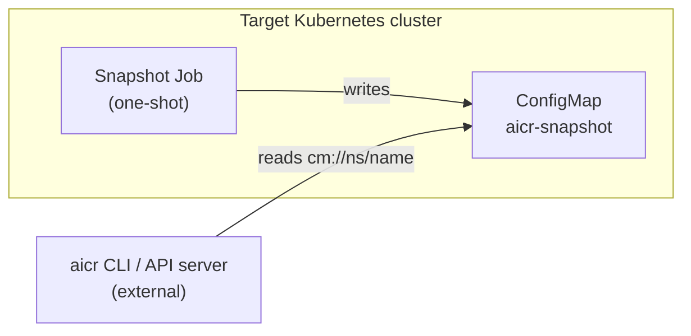

# AICR Architecture

This page is the architecture entry point for AICR contributors and
maintainers. Its primary job is to set boundaries: what AICR is, what
it isn't, and what kinds of contributions belong here.

For task-level guides see the per-component pages: [CLI](cli.md),
[API server](api-server.md), [validator](validator.md),
[component validations](validations.md), [bundlers](component.md),
[recipes and data](data.md).

## What AICR Is

AICR is a **design-time tool**. Given a description of a target
environment, it generates validated GPU-cluster configuration artifacts
that an established deployment tool — Helm, Argo CD, Flux — consumes.

Core artifacts:

| Artifact | Role | Produced by |
|----------|------|-------------|
| **Snapshot** | Normalized state of an existing cluster (input) | `aicr snapshot` or the snapshot agent Job |
| **Recipe** | Declarative spec resolved from registry, criteria, and overlays | `aicr recipe` |
| **Validation report** | Recipe constraints evaluated against a snapshot | `aicr validate` |
| **Bundle** | Per-component deployment artifact in a tool-specific format | `aicr bundle` |

Each stage produces a serializable artifact (file or ConfigMap) and is
independently invocable. Reproducibility — same inputs, same outputs —
is non-negotiable.

## What AICR Is Not

AICR is not a deployment engine. It does not:

- Apply manifests or run `kubectl apply`
- Wait for resources to become ready
- Implement uninstall, rollback, or upgrade semantics
- Reconcile drift or run as an in-cluster controller
- Orchestrate cross-component dependencies at runtime

These responsibilities belong to the deployment tool that consumes
AICR's artifacts (e.g. Helm, Argo CD, Flux). These tools own release reconciliation and lifecycle.

A note on terminology: code under `pkg/bundler` includes things we
call *deployers*. They are **output adapters** that emit artifacts in
a tool-specific format (Helm bundle, Argo CD `Application`). They do
not perform deployment.

The only in-cluster component is the **snapshot agent** — a one-shot
Kubernetes Job that captures cluster state into a ConfigMap and
exits. It is an input collector, not a long-lived runtime component,
and is not part of the deployed system.

## Architectural Boundaries

These boundaries are the primary review criterion for contributions.
A change that crosses them is a re-architecture, not a feature, and
should be discussed in an issue or ADR before code is written.

**In scope — artifact generation:**

- Recipe authoring: registry entries, mixin composition, overlay resolution
- Snapshot collectors that capture cluster, OS, GPU, or platform state
- Validators that evaluate recipe constraints against measurements
- New bundle output formats targeting **community-standard** deployment tools
- Supply-chain provenance for generated artifacts (SBOMs, attestations, signing)

**Out of scope — deployment-time concerns:**

- Apply / wait / uninstall logic embedded in AICR
- Drift detection or reconciliation loops
- In-cluster controllers or operators owned by AICR
- Custom or proprietary deployment mechanisms (e.g., a "direct" deployer
  built on `kubectl apply` plus bespoke wait scripts and custom uninstall
  logic)

If a feature requires AICR to keep running after artifact generation, or
to drive `kubectl` and direct API calls to deploy what it produced, it
belongs in a deployment tool — not AICR.

## Community-Standard Deployment Targets

AICR emits artifacts in formats consumed by **community-standard**
deployment tools. We target what the community already uses rather
than rolling our own:

- **Helm** — per-component bundles with `values.yaml` and an install script
- **Argo CD** — `Application` manifests with `sync-wave` ordering

We are open to adding support for additional community-standard
targets (Flux, Helmfile, Kustomize) when there is demonstrated demand.
We do not add custom or proprietary deployment mechanisms: they create
unsustainable maintenance burden without serving the broader community,
and they pull deployment-time orchestration into AICR — the boundary we
are explicitly maintaining.

## First Principles

### Metadata Is Separate from How It Is Consumed

Validated configuration exists independent of how it is rendered,
packaged, or deployed. Correctness must not be coupled to a specific
tool, workflow, or delivery mechanism.

### Correctness Must Be Reproducible

Given the same inputs, the same system version must always produce the
same result. This rules out hidden state, implicit defaults, and
non-deterministic behavior — all of which would break the trust model
that downstream consumers rely on.

### Recipe Specialization Requires Explicit Intent

More specific recipes must never be matched unless explicitly
requested. Generic intent cannot silently resolve to specialized
configurations. This preserves user control and prevents accidental
misconfiguration.

### Trust Requires Verifiable Provenance

Trust is established through evidence, not assertions. Every released
artifact must carry verifiable, non-falsifiable proof of where it came
from and how it was produced. See [SECURITY.md](https://github.com/NVIDIA/aicr/blob/main/SECURITY.md)
for SLSA, SBOM, and attestation details.

### Adoption Comes from Value and Idiomatic Experience

The system must integrate into how users already work. AICR provides
validated configuration, not a new operational model. If adoption
requires retraining users on "the right way," the design has failed.

## Workflow

```
┌──────────┐    ┌────────┐    ┌──────────┐    ┌────────┐
│ Snapshot │───▶│ Recipe │───▶│ Validate │───▶│ Bundle │
└──────────┘    └────────┘    └──────────┘    └────────┘
   capture       generate       check          emit
   cluster       optimized      constraints    deployment
   state         config         vs. actual     artifacts
```

Stages can be invoked individually or chained. Inputs and outputs flow
through files, stdout, or Kubernetes ConfigMaps (`cm://namespace/name`
URI), which lets the snapshot agent hand off to a CLI or API server
running outside the cluster. Detail per stage lives in the
[CLI](cli.md) and [API server](api-server.md) pages.

## Packages

| Package | Responsibility | Detail |
|---------|----------------|--------|
| `pkg/cli` | User interaction (flags, output formatting) — no business logic | [cli.md](cli.md) |
| `pkg/server` | aicrd HTTP server: middleware chain + REST handlers (thin adapters over `pkg/client/v1`) — no business logic | [api-server.md](api-server.md) |
| `pkg/client/v1` | aicr.Client facade — the shared SDK used by CLI, server, and external Go callers | — |
| `pkg/recipe` | Recipe resolution, overlays, registry | [data.md](data.md) |
| `pkg/bundler` | Per-component bundle generation, output adapters | [component.md](component.md) |
| `pkg/component` | Bundler utilities and test helpers | [component.md](component.md) |
| `pkg/collector` | System state collection (parallel via errgroup) | — |
| `pkg/collector/topology` | Cluster-wide node taint/label topology collection | — |
| `pkg/snapshotter` | Orchestrates collector execution and aggregates measurements | — |
| `pkg/validator` | Constraint evaluation; container-per-validator | [validator.md](validator.md), [validations.md](validations.md) |
| `pkg/k8s/client` | Singleton Kubernetes clientset (in-cluster + kubeconfig) | — |
| `pkg/k8s/pod` | Shared K8s Job/Pod helpers (wait, logs, ConfigMap URI parsing) | — |
| `pkg/errors` | Structured errors with codes | — |
| `pkg/defaults` | Centralized timeout and limit constants | — |

**Critical separation:** `pkg/cli` and `pkg/server` are user-interaction
packages — they capture intent, validate input, and format output. All
business logic lives in functional packages (composed by the
`pkg/client/v1` facade) so both entry points share it. Adding business
logic to `pkg/cli` or `pkg/server` handlers is a boundary violation.

## Key Design Decisions

### Concurrent collection with `errgroup`

Collectors run in parallel under `errgroup.WithContext`. Failure of any
collector cancels the rest via context. Fail-fast is the default;
best-effort partial collection would hide systemic problems behind
partial data and is intentionally not supported.

### Pluggable collectors via factory

Collectors implement a common interface and self-register. Adding a
new state source does not modify existing collectors.

### Immutable recipe store

The recipe store is read-only after initialization (`sync.Once`).
Mutations happen on per-request clones. This avoids locks and makes
the API server safe for concurrent requests.

### Singleton Kubernetes client

`pkg/k8s/client` caches a single clientset across the process to avoid
connection exhaustion. Both in-cluster and out-of-cluster (kubeconfig)
authentication are supported transparently.

### Watch over poll

Long-running Kubernetes operations (waiting for a Job) use the watch
API rather than polling loops. See `pkg/k8s/pod`.

### Structured errors with codes

All errors flow through `pkg/errors` with a typed code. The HTTP
layer maps codes to status; the CLI maps codes to exit codes. Wrapping
rules and error code semantics live in
[CLAUDE.md](https://github.com/NVIDIA/aicr/blob/main/.claude/CLAUDE.md).

## Deployment Topologies

AICR can be invoked in three shapes. None of them are runtime components
in the deployed cluster — all are design-time tooling.

### CLI

Single binary. Local development, CI pipelines, troubleshooting.

### API server

Stateless HTTP service for programmatic recipe and bundle generation.
Multi-tenant deployments scale horizontally behind a load balancer.
The server returns artifacts; it does not deploy them. Endpoints,
middleware, and operational details live in
[api-server.md](api-server.md).

### Snapshot agent (one-shot Job)

A Kubernetes Job that runs once on a target cluster, captures state
into a ConfigMap, and exits. The CLI or API server reads the ConfigMap
(`cm://namespace/name` URI) as input to recipe generation or
validation. The Job is not a controller, has no reconcile loop, and is
not part of the deployed system.



## Failure Handling

Reproducibility requires that failures during artifact generation be
explicit, not silent. See `pkg/errors` for code semantics.

- **Collector failure** — fail-fast via `errgroup`. The whole snapshot
  fails. Best-effort mode is intentionally not the default.
- **Kubernetes API unavailable** — bounded retries with exponential
  backoff via `client-go/util/retry`. After exhaustion, return a
  structured error; do not synthesize fake measurements.
- **ConfigMap write failure (snapshot agent)** — retry, then exit
  non-zero. The Job's status surfaces the failure to the operator.
  Do not fall back to a side channel.

HTTP-layer failure handling (rate limiting, graceful shutdown, panic
recovery) lives in [api-server.md](api-server.md). Supply-chain and
CI failure handling lives in
[CONTRIBUTING.md](https://github.com/NVIDIA/aicr/blob/main/CONTRIBUTING.md).

## Further Reading

- [CONTRIBUTING.md](https://github.com/NVIDIA/aicr/blob/main/CONTRIBUTING.md) — contribution process, DCO, CI/CD, E2E testing
- [DEVELOPMENT.md](https://github.com/NVIDIA/aicr/blob/main/DEVELOPMENT.md) — dev environment setup and Make targets
- [SECURITY.md](https://github.com/NVIDIA/aicr/blob/main/SECURITY.md) — supply-chain security, threat model, attestation verification
- [docs/design/](https://github.com/NVIDIA/aicr/tree/main/docs/design) — accepted ADRs
- Per-component pages: [cli.md](cli.md), [api-server.md](api-server.md), [validator.md](validator.md), [validations.md](validations.md), [component.md](component.md), [data.md](data.md)
