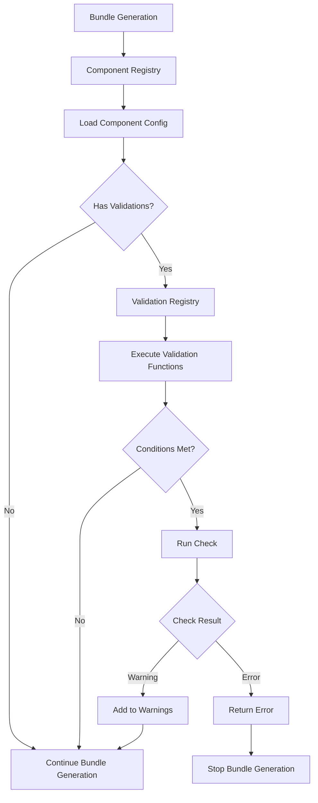

# Component Validation System

Learn how to define and use component validations in AICR.

> **Note:** This document covers **component validations** — condition-based checks that run during bundle generation (e.g., missing config, incompatible settings). For the **container-per-validator engine** used by `aicr validate`, see the [Validator Development Guide](validator.md) and [Validator Extension Guide](../integrator/validator-extension.md).

## Overview

The component validation system allows components to register validation checks that run automatically during bundle generation. Validations can check for missing configuration, incompatible settings, or other conditions that might cause deployment issues.

**Key Features:**
- **Component-Driven**: Validations are defined in the component registry (`recipes/registry.yaml`)
- **Condition-Based**: Validations run only when specific conditions are met (e.g., intent, service)
- **Severity Levels**: Each validation can be a "warning" (non-blocking) or "error" (blocking)
- **Custom Messages**: Optional detail messages provide actionable guidance
- **Extensible**: New validation functions can be added without modifying core bundler code

## Architecture



## Defining Validations

Validations are defined in the component registry (`recipes/registry.yaml`) under each component's configuration.

### Validation Configuration Structure

```yaml
components:
  - name: my-component
    # ... other component config ...
    validations:
      - function: CheckFunctionName
        severity: warning  # or "error"
        conditions:
          intent:
            - training
            - inference
          service:
            - eks
        message: "Optional detail message explaining the issue and how to resolve it"
```

### Validation Fields

| Field | Type | Required | Description |
|-------|------|----------|-------------|
| `function` | string | Yes | Name of the validation function to execute (e.g., "CheckWorkloadSelectorMissing") |
| `severity` | string | Yes | Severity level: "warning" (non-blocking) or "error" (blocking) |
| `conditions` | map[string][]string | No | Conditions that must be met for validation to run. Keys are criteria fields (intent, service, accelerator, os, platform). Values are arrays of strings for OR matching. |
| `message` | string | No | Optional detail message appended to validation results. Provides actionable guidance. |

### Conditions

Conditions use arrays of strings for OR matching. A single-element array is equivalent to a single value:

```yaml
# Single value (matches only "training")
conditions:
  intent:
    - training

# Multiple values (matches "training" OR "inference")
conditions:
  intent:
    - training
    - inference

# Multiple conditions (all must match)
conditions:
  intent:
    - training
  service:
    - eks
    - gke
```

**Supported Condition Keys:**
- `intent`: Workload intent (training, inference)
- `service`: Kubernetes service (eks, gke, aks, oke, kind, lke)
- `accelerator`: GPU type (h100, gb200, b200, a100, l40, rtx-pro-6000)
- `os`: Operating system (ubuntu, rhel, cos, amazonlinux, talos)
- `platform`: Platform/framework (dynamo, kubeflow, nim, runai, slurm)

### Example: Nodewright Customizations Validations

```yaml
components:
  - name: nodewright-customizations
    # ... other config ...
    validations:
      # Check for missing workload-selector when training intent
      - function: CheckWorkloadSelectorMissing
        severity: warning
        conditions:
          intent:
            - training
        message: "This may cause nodewright to evict running training jobs. Consider setting --workload-selector to prevent eviction."
      
      # Check for missing accelerated-node-selector for training/inference
      - function: CheckAcceleratedSelectorMissing
        severity: warning
        conditions:
          intent:
            - training
            - inference
        message: "Without this selector, the customization will run on all nodes. Consider setting --accelerated-node-selector to target specific nodes."
```

## Available Validation Functions

### CheckWorkloadSelectorMissing

Checks if `--workload-selector` is missing when conditions are met.

**Use Case**: Prevent nodewright from evicting running training jobs by ensuring workload selector is configured.

**Example:**
```yaml
validations:
  - function: CheckWorkloadSelectorMissing
    severity: warning
    conditions:
      intent:
        - training
    message: "This may cause nodewright to evict running training jobs. Consider setting --workload-selector to prevent eviction."
```

### CheckAcceleratedSelectorMissing

Checks if `--accelerated-node-selector` is missing when conditions are met.

**Use Case**: Ensure node selectors are configured to target specific nodes rather than running on all nodes.

**Example:**
```yaml
validations:
  - function: CheckAcceleratedSelectorMissing
    severity: warning
    conditions:
      intent:
        - training
        - inference
    message: "Without this selector, the customization will run on all nodes. Consider setting --accelerated-node-selector to target specific nodes."
```

### CheckHostMofedWithoutNetworkOperator

Flags components requesting host-mode MOFED when the `network-operator` component is not in the recipe (host MOFED requires the network operator to manage the kernel modules).

## Creating New Validation Functions

To add a new validation function, follow these steps:

### Step 1: Implement the Validation Function

Create a new function in `pkg/bundler/validations/checks.go`:

```go
// CheckMyNewValidation checks for a specific condition.
// This is a generic check that can be used by any component.
func CheckMyNewValidation(ctx context.Context, componentName string, recipeResult *recipe.RecipeResult, bundlerConfig *config.Config, conditions map[string][]string) ([]string, []error) {
    if bundlerConfig == nil {
        return nil, nil
    }

    // Check if component exists in recipe
    hasComponent := false
    for _, ref := range recipeResult.ComponentRefs {
        if ref.Name == componentName {
            hasComponent = true
            break
        }
    }

    if !hasComponent {
        return nil, nil
    }

    // Check conditions
    if !checkConditions(recipeResult, conditions) {
        return nil, nil
    }

    // Perform your validation check
    // Example: Check if some config is missing
    if someConfigMissing {
        baseMsg := fmt.Sprintf("%s is enabled but required configuration is missing", componentName)
        slog.Warn(baseMsg,
            "component", componentName,
            "conditions", conditions,
        )
        return []string{baseMsg}, nil
    }

    return nil, nil
}
```

### Step 2: Register the Function

Add the function to the auto-registration in `pkg/bundler/validations/checks.go`:

```go
// init auto-registers validation functions in this package.
func init() {
    registerCheck("CheckWorkloadSelectorMissing", CheckWorkloadSelectorMissing)
    registerCheck("CheckAcceleratedSelectorMissing", CheckAcceleratedSelectorMissing)
    registerCheck("CheckHostMofedWithoutNetworkOperator", CheckHostMofedWithoutNetworkOperator)
    registerCheck("CheckMyNewValidation", CheckMyNewValidation)  // Add your new function
}
```

### Step 3: Add to Component Registry

Add the validation to your component's configuration in `recipes/registry.yaml`:

```yaml
components:
  - name: my-component
    # ... other config ...
    validations:
      - function: CheckMyNewValidation
        severity: warning
        conditions:
          intent:
            - training
        message: "Optional detail message explaining the issue"
```

### Step 4: Add Tests

Create tests in `pkg/bundler/validations/checks_test.go`:

```go
func TestCheckMyNewValidation(t *testing.T) {
    tests := []struct {
        name           string
        componentName  string
        recipeResult   *recipe.RecipeResult
        bundlerConfig  *config.Config
        conditions     map[string][]string
        wantWarnings   int
        wantErrors     int
    }{
        // Test cases...
    }

    for _, tt := range tests {
        t.Run(tt.name, func(t *testing.T) {
            ctx := context.Background()
            warnings, errors := CheckMyNewValidation(ctx, tt.componentName, tt.recipeResult, tt.bundlerConfig, tt.conditions)
            // Assertions...
        })
    }
}
```

## Validation Function Interface

All validation functions must implement the `ValidationFunc` signature:

```go
type ValidationFunc func(
    ctx context.Context,
    componentName string,
    recipeResult *recipe.RecipeResult,
    bundlerConfig *config.Config,
    conditions map[string][]string,
) (warnings []string, errors []error)
```

**Parameters:**
- `ctx`: Context for cancellation/timeout
- `componentName`: Name of the component being validated (from recipe)
- `recipeResult`: The recipe result containing component refs and criteria
- `bundlerConfig`: The bundler configuration (for accessing CLI flags)
- `conditions`: Conditions from the validation config (map of criteria field to array of values)

**Returns:**
- `warnings`: List of warning messages (non-blocking, displayed to user)
- `errors`: List of error messages (blocking, stops bundle generation)

## Condition Matching Logic

The `checkConditions` function uses the matching logic from `recipe/criteria.go` for consistency:

- **Empty conditions**: Validation always runs (no conditions to check)
- **Array values**: OR matching - actual value must match any value in the array
- **Multiple conditions**: AND matching - all conditions must match
- **Criteria matching**: Uses `matchesCriteriaField` for consistent field matching

**Example:**
```yaml
conditions:
  intent:
    - training
    - inference
  service:
    - eks
```

This validation runs when:
- Intent is "training" OR "inference" AND
- Service is "eks"

## Severity Levels

### Warning (Non-Blocking)

Warnings are displayed to the user but do not stop bundle generation. Use for missing optional configuration, best-practice recommendations, potential performance issues, or informational messages.

```yaml
severity: warning
```

Output:
```
Note:
  ⚠ Warning: Component is enabled but optional configuration is missing.
```

### Error (Blocking)

Errors stop bundle generation and return an error. Use for missing required configuration, incompatible settings, critical deployment issues, or security concerns.

```yaml
severity: error
```

Output:
```
Error: Component validation failed: required configuration is missing
```

## Best Practices

1. **Be Specific**: Provide clear, actionable messages that explain what's wrong and how to fix it
2. **Use Conditions Wisely**: Only run validations when they're relevant to avoid noise
3. **Prefer Warnings**: Use warnings for non-critical issues; reserve errors for blocking problems
4. **Reuse Existing Checks**: Use generic checks like `CheckWorkloadSelectorMissing` when possible
5. **Test Thoroughly**: Add comprehensive tests covering all condition combinations
6. **Document Usage**: Include examples in component documentation

## Examples

### Example 1: Simple Condition Check

```yaml
validations:
  - function: CheckWorkloadSelectorMissing
    severity: warning
    conditions:
      intent:
        - training
    message: "Training workloads should specify a workload selector to prevent eviction."
```

### Example 2: Multiple Conditions

```yaml
validations:
  - function: CheckAcceleratedSelectorMissing
    severity: warning
    conditions:
      intent:
        - training
        - inference
      service:
        - eks
        - gke
    message: "EKS and GKE deployments should specify accelerated node selectors for GPU workloads."
```

### Example 3: Error Severity

```yaml
validations:
  - function: CheckRequiredConfig
    severity: error
    conditions:
      intent:
        - training
    message: "Training workloads require this configuration. Bundle generation cannot continue."
```

## Troubleshooting

**Validation not running:**
- Check that the component is in the recipe's `componentRefs`
- Verify conditions match the recipe's criteria
- Check that the validation function is registered in `checks.go` init()

**Warning not displayed:**
- Verify the validation function returns warnings (not empty slice)
- Check that severity is "warning" (not "error")
- Ensure the bundler is collecting warnings correctly

**Error stopping bundle:**
- Check that severity is "error" (not "warning")
- Verify the validation function returns errors
- Review the error message for details

## Related Documentation

- [Component Development Guide](component.md) - How to add new components
- [CLI Reference](../user/cli-reference.md) - User-facing validation documentation
- [Recipe Criteria](../user/cli-reference.md#aicr-recipe) - Understanding recipe criteria
